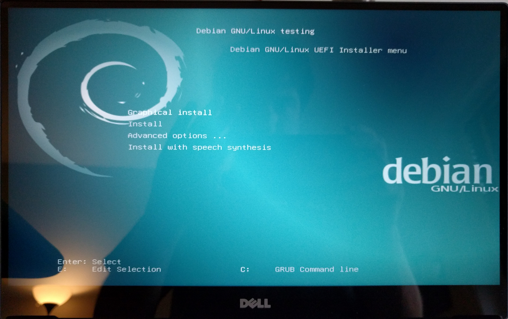
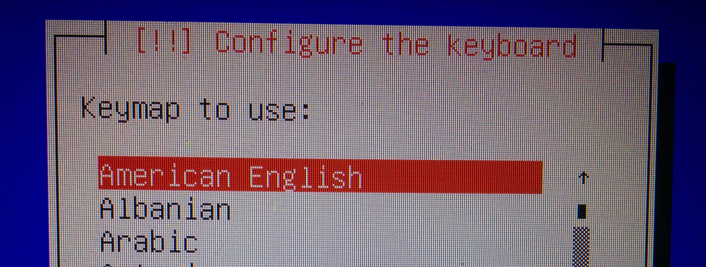
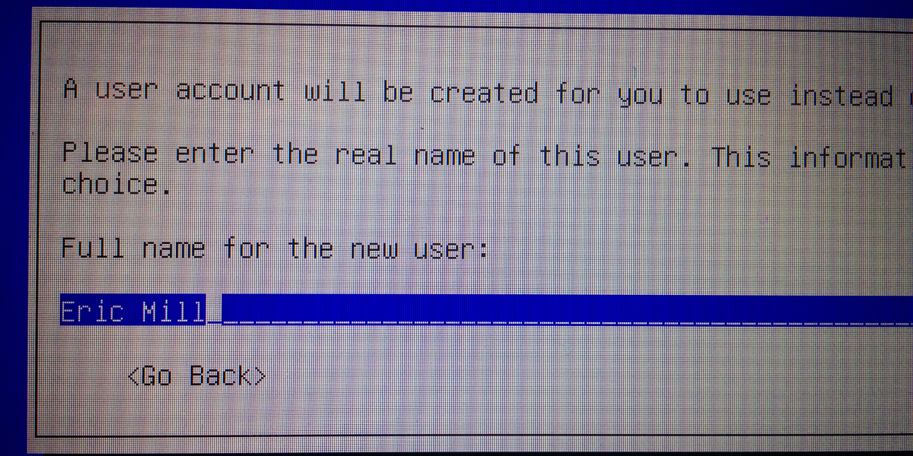
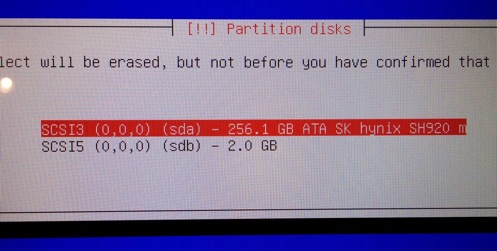
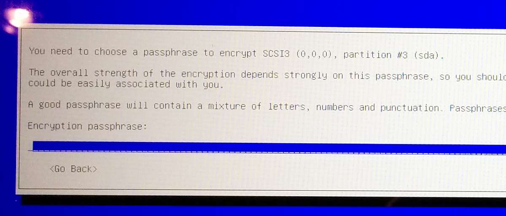
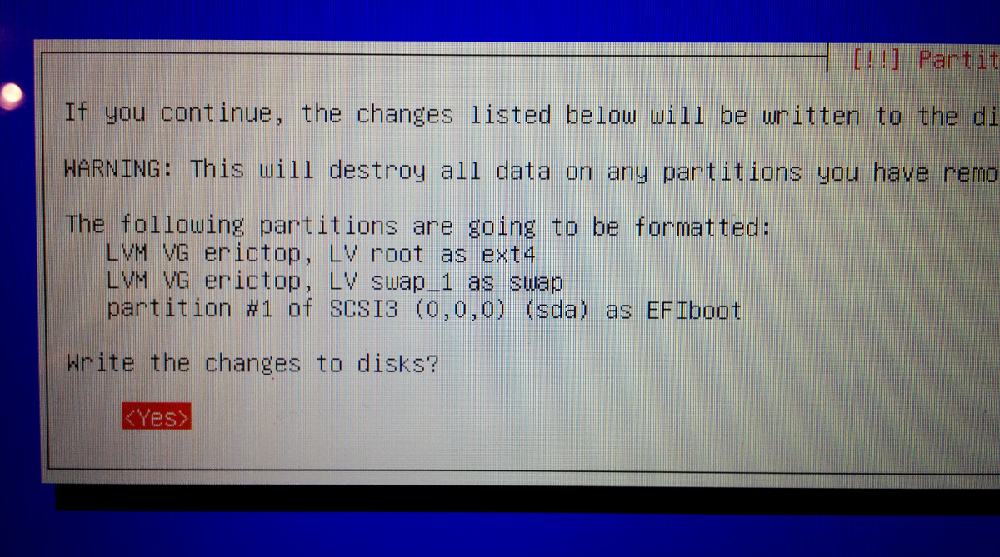
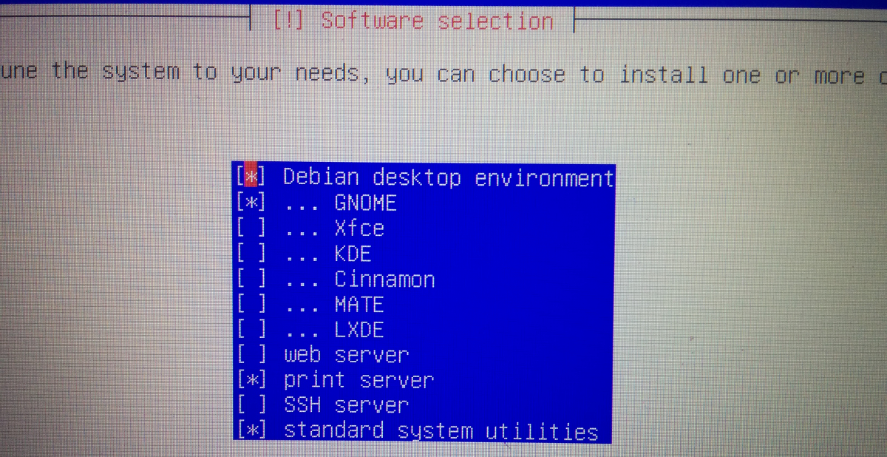

## Installing Debian 7 on a Dell XPS

Notes from me, [Eric Mill](https://twitter.com/konklone), as I installed Debian for the first time, onto a new laptop, with sage advice and spiritual guidance from [Paul Tagliamonte](https://twitter.com/paultag).

You will need:

* **A USB drive** with at least 1 GB of space.
* **A USB network connection.** Like a smartphone that can tether a WiFi connection over USB, or a USB WiFi stick.

### You Will Also Need A Computer

I am using a Dell XPS 13, Developer edition, 4th generation, purchased through the Dell Ubuntu program:

> http://dell.com/ubuntu

The Dell Ubuntu program is managed by a friendly, competent team of Linux-friendly folk inside Dell who ensure that your computer will Just Work with Linux. The Dell XPS is used by multiple Debian team members, so your pain points will be theirs, and they will fix things.

Supporting Dell's program is a wonderful thing to do, and it's also just a **great goddamned laptop**.

### You Will Also Need Debian

Debian has `unstable`, `testing`, and `stable` versions.

* `unstable` is the most fresh: the edge.
* `testing` runs 10 days behind `unstable`, and is probably what you want.
* `stable` is (deliberately) quite out of date as it waits for software to prove itself, and because of that is extremely stable. It runs underwater robots.

http://cdimage.debian.org/cdimage/jessie_di_beta_2/amd64/iso-cd/


### Preparing Debian for Installation

First, we'll be flashing the USB drive. From Ubuntu:

* Find the device ID: it will probably look like `/dev/sdb`.
* If the ISO has been renamed to `debian.iso`, and the device is `/dev/sdb`, run:

```bash
sudo dd if=debian.iso of=/dev/sdX
```

* Reboot the computer.
* On boot, **go into the BIOS** by pressing F2 while the Dell logo appears.
* Go to the `Boot` menu.
* Switch the `Boot List Option` to `UEFI`, and the `Load Legacy Option Rom` option to `Disabled`.


* **Warning:** After you turn on UEFI mode, you will not be able to boot back into whatever you were coming from (e.g. if you change your mind), unless you return here and switch this option back to Legacy Boot.
* Reboot the machine by saving and exiting the BIOS.
* On boot, **go into Boot Options** by pressing F2 while the Dell logo appears.
* Select the USB drive under the UEFI section.


You should soon see the Debian install screen pop up.

### Installing Debian

You should be at the graphical installer screen.



**General warning:** The installer has "Go Back" options laid throughout the process. It may not always do what you think. While it will usually be fine, and as much as I hate to say it: try to get each step right the first time. If you end up "Going Back" and it doesn't look like you've actually gone back, consider starting over fresh.

**General encouragement:** There's a lot of steps, but this is all super easy. You will be just fine.

* Pick the top option, `Install`.

* Choose your language (e.g. `English`), your country (e.g. `United States`), and your key map (e.g. 'American English').




* Then it will try to find a network connection. Maybe it'll work with your WiFi, but it failed for me:


* Plug in your USB network connection. Hit `Tab` to highlight `Go Back`, then hit `Enter` to return to this screen, and select `Detect Network Hardware`:


* Then enter your hostname, which is essentially your computer name (mine was `erictop`).


* When it asks for a domain name, leave it blank and hit Enter.


* Enter a password for the `root` user, and verify the password.


* Now you'll make a user account. Enter your full name (e.g. `Eric Mill`).



* And pick a username (e.g. `eric`). This is the user you'll be running as.


* Enter a password for that user, and verify that password.


* Pick your time zone.


### Setting up your disk

Now you'll be asked about disk stuff. This can be intimidating, but don't worry about it.

I'm going for **full disk encryption**. The Debian installer makes this super easy. The downsides are:

* You'll enter a password when you boot your computer up, or resume from hibernation. (Not from ordinary sleep.)
* Can add some slight latency on some kinds of disk writes. This isn't a common problem, and you shouldn't notice much of anything in practice.
* Will make the _install_ process take a couple hours, as it first erases every block of the disk.

The upside is your **entire disk is goddamn encrypted**, which makes you more safe from attackers the world over. And **it's so easy**: besides the boot password, there's no impact on usability. I strongly recommend it.

* To encrypt, go with the third option:


* Just put everything on one partition.


* It will ask you to confirm which disk you want to encrypt and write Debian to. Make sure you pick your actual hard drive, not the USB flash drive.



* It'll ask you to really confirm what you're about to do:


* Then prepare for the disk erasing to take a long time.


* When it finishes, enter in the disk encryption passphrase, and verify it.




* Then you'll get 2 confirmation prompts in sequence, to confirm that you want to write the partitions to disk. Go for it.




* This will begin installing the base system.


* First, it'll ask you to pick the country it should look for a close Debian archive in.


* Then, it'll offer you some specific mirrors. Pick whatever.


* It'll ask you to pick a proxy. You can leave it blank and hit `Enter`.


* It will ask you whether you'd like to participate in submitting weekly analytics to the Debian team about your packages. As of version 1.6 of `popcon`, which is contained in the `.iso` I downloaded, this information is encrypted, so I elected to participate.


* It will ask about what pieces of the system you'd like to install. The defaults are fine: "Debian desktop", "GNOME", "print server", "standard system utilities".



* When it finishes, you should be done!


Reboot the computer.

### Debian: First Boot

On your first boot, you should end up at the new Debian-themed Grub boot loader. The default is what you want, and you can either hit Enter or it it will proceed automatically after a few seconds.


On your first boot, the disk decryption prompt is scary and stark. **We'll make this screen much nicer** in a moment, but for now just enter your disk decryption passphrase.


You should end up at a pleasant login screen!


And after logging in with your user password, you should end up at a pleasant desktop!


Try [testing out your touch screen](https://www.youtube.com/watch?v=sowvI6FisUc).

Now we'll take care of a few things you'll almost certainly want around for day-to-day Debian use.

#### Giving yourself sudo

`sudo` doesn't ship with Debian. Become `root` to install it:

```bash
su
```

Install it with `apt`:

```bash
apt install sudo
```

Then add yourself to sudo. Replace `eric` with your username:

```bash
adduser eric sudo
```

**Log out and log in** to get this to take effect.

#### Working WiFi

Next, let's get your WiFi working. You'll have to install `non-free` packages, which is a bummer.

Edit `/etc/apt/sources.list` to add `contrib non-free` to the end of each entry. Mine ended up looking like this:

```
deb http://ftp.us.debian.org/debian/ jessie main contrib non-free
deb-src http://ftp.us.debian.org/debian/ jessie main contrib non-free

deb http://security.debian.org/ jessie/updates main contrib non-free
deb-src http://security.debian.org/ jessie/updates main contrib non-free

# jessie-updates, previously known as 'volatile'
deb http://ftp.us.debian.org/debian/ jessie-updates main contrib non-free
deb-src http://ftp.us.debian.org/debian/ jessie-updates main contrib non-free

# jessie-backports, previously on backports.debian.org
deb http://ftp.us.debian.org/debian/ jessie-backports main contrib non-free
deb-src http://ftp.us.debian.org/debian/ jessie-backports main contrib non-free
```

Then update your packages and install the wifi package:

```bash
sudo apt-get update
sudo apt-get install firmware-iwlwifi
```

On your next boot, you should see working WiFi:


#### Scaling up for the high-res screen

You'll want to scale GNOME, and any web browsers you use to use a scaling factor of 125%.

**In GNOME**, just run:

```bash
gsettings set org.gnome.desktop.interface text-scaling-factor 1.25
```

(There's a preferences pane for this, but it won't let you set decimal values.)

**In Firefox or Iceweasel**, visit about:config, and search for "css". Find `layout.css.devPixelsPerPx` and change the value from `-1.0` (system default) to `1.25`.

**In Chrome**, visit the Settings page at `chrome://settings/`, click "Show advanced settings..." and scroll down to "Web content", then set the "Page zoom" to `125%`.


#### Graphical boot

If you want your boot to look nicer, and to enter in your disk decryption password in a clean, well-lighted place, then you need to [install Plymouth](https://miguelmenendez.pro/en/articles/install-plymouth-debian-graphical-boot-animation-while-boot-shutdown.html).

Start with:

```bash
sudo apt install plymouth plymouth-themes
```

Then edit `/etc/initramfs-tools/modules` and add the following lines:

```
# KMS
  intel_agp
  drm
  i915 modeset=1
```

Then edit `/etc/default/grub` and add this line:

```
GRUB_GFXMODE=1920x1080
```

And **edit** the `GRUB_CMDLINE_LINUX_DEFAULT` line to read:

```
GRUB_CMDLINE_LINUX_DEFAULT="quiet splash"
```

Update Grub to pick up the changes:

```bash
update-grub2
```

Set the default theme to `lines`:

```bash
/usr/sbin/plymouth-set-default-theme lines
```

Apply the changes:

```bash
update-initramfs -u
```

And reboot! You should see a nice graphical interface when it's time to enter your disk password. The lines background should even animate for a second during the decryption.


### TODO

Some notes for myself of stuff to do later:

* I like keyboard shortcuts
* extensions.gnome.org WHAT
* alternate tab
* get ubuntu fonts
* swap ctrl + fn keys
* why won't Delete delete things
* static workspaces
* workspace grid
  - download zip of fork of workspace grid extension on github
  - open up gnome-tweaks and load in .zip
  - open up gnome-shell-extension-prefs and enable it
  - on next boot/login it should work
* how do I get Alt+Click to grab window
* test out u2f instructions
  - if they work, update blog post to say debian also
* update my personal ubuntu repo to point to debian repo
* disable soft keyboard
