## Installing Debian 8 on a Dell XPS

Notes from me, [Eric Mill](https://twitter.com/konklone), as I installed Debian with sage advice and spiritual guidance from [Paul Tagliamonte](https://twitter.com/paultag).

To install Debian 8 onto a _Macbook Pro_, check out [Jessie Frazelle's tutorial](https://blog.jessfraz.com/post/linux-on-mac/).

You will need:

* **A USB drive** with at least 1 GB of space.
* **A USB network connection.** Like a smartphone that can tether a WiFi connection over USB, or a USB WiFi stick.

### You Will Also Need A Computer

__TODO__: Update with model and photo of new computer below

I am using a Dell XPS 13 purchased through the Dell Ubuntu program:

> https://www.dell.com/sputnik

[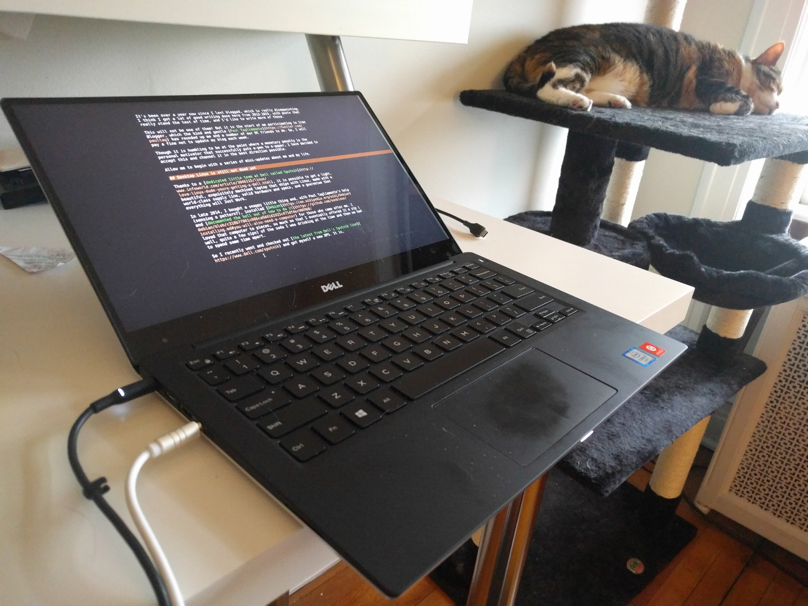](images/xps/new-xps-with-cat.jpg)

Dell calls their program [Project Sputnik](https://sputnik.github.io/), and it is managed by a friendly team of Linux engineers inside Dell who [partner with Ubuntu](http://partners.ubuntu.com/dell) to ensure that your computer will Just Work with Linux.

The Dell XPS is also used by multiple Debian team members, so your pain points will be theirs, and they're likely to quickly fix things.

Supporting Dell's program is a wonderful thing to do, and it's also just a **great goddamned laptop**.

### You Will Also Need Debian

Debian has `unstable`, `testing`, and `stable` versions.

* `unstable` is the most fresh: the edge.
* `testing` runs 10 days behind `unstable`, and is probably what you want.
* `stable` is (deliberately) quite out of date as it waits for software to prove itself, and because of that is extremely stable. It runs underwater robots.

This guide uses the latest beta image, on the `testing` channel. As of writing, the [latest listed Debian testing CD](http://cdimage.debian.org/cdimage/weekly-builds/amd64/iso-cd/) was:

> http://cdimage.debian.org/cdimage/weekly-builds/amd64/iso-cd/debian-testing-amd64-netinst.iso

The instructions below assume the downloaded file has been renamed to `debian.iso`.

### Preparing Debian for Installation

First, we'll be flashing the USB drive. From Ubuntu:

* Find the device ID: it will probably look like `/dev/sdb`.
* Assuming an ISO renamed to `debian.iso`, **replace** `/dev/sdX` with _your_ device name for the USB flash drive, and run:

```bash
sudo dd if=debian.iso of=/dev/sdX
```

Now we'll tell the computer to boot from the USB drive first.

* Plug in the flashed USB drive to the XPS.
* Reboot the computer.
* On boot, **go into the BIOS** by pressing F2 while the Dell logo appears.
* Go to the `Secure Boot Enable` subsection of the `Secure Boot` section, and disable secure boot. (Debian [does not support UEFI Secure Boot yet](https://wiki.debian.org/UEFI). Sadness.)

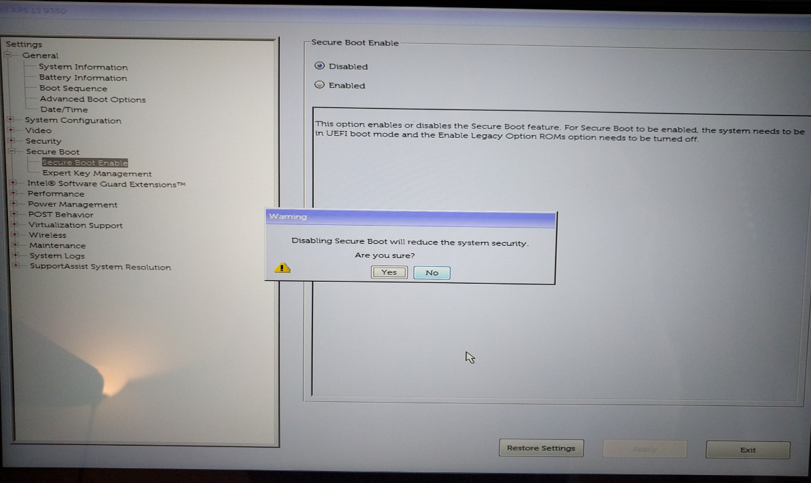

* Use the `Apply` button, and confirm the popup dialog that appears.
* `Exit` the BIOS screen. The computer will restart.
* On boot, **go into the one-time boot screen** by pressing F12 while the Dell logo appears.
* Select the option that looks like your USB drive.

You should soon see the Debian install screen pop up.

### Installing Debian

You should be at the installer screen.


**General warning:** The installer has "Go Back" options laid throughout the process. It may not always do what you think. While it will usually be fine, and as much as I hate to say it: try to get each step right the first time. If you end up "Going Back" and it doesn't look like you've actually gone back, consider starting over fresh.

**General encouragement:** There's a lot of steps, but this is all super easy. You will be just fine.

* Pick the **second option**, `Install`.

* Choose your language (e.g. `English`), your country (e.g. `United States`), and your key map (e.g. 'American English').


* Then it will try to find a network connection. It's likely to say that it can't use your WiFi card without installing new packages. Say `No`.

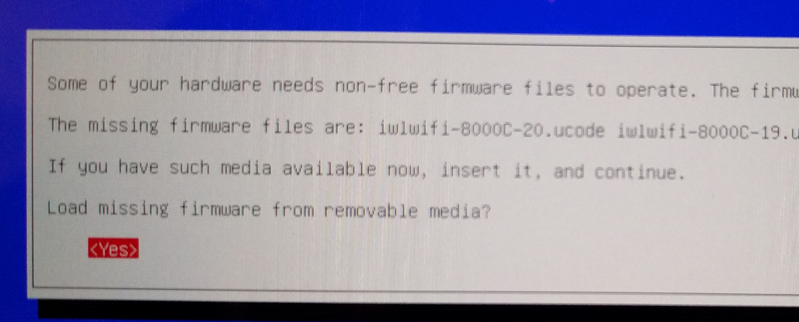

* You'll arrive at a screen showing you options. **Don't** select "no ethernet card". Plug in your USB network connection. Hit `Tab` to highlight `Go Back`, then hit `Enter`.


* That will take you here. Select `Detect Network Hardware`:

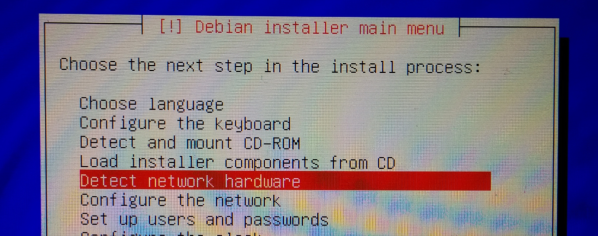

* Then enter your hostname, which is essentially your computer name (mine was `erictop`).

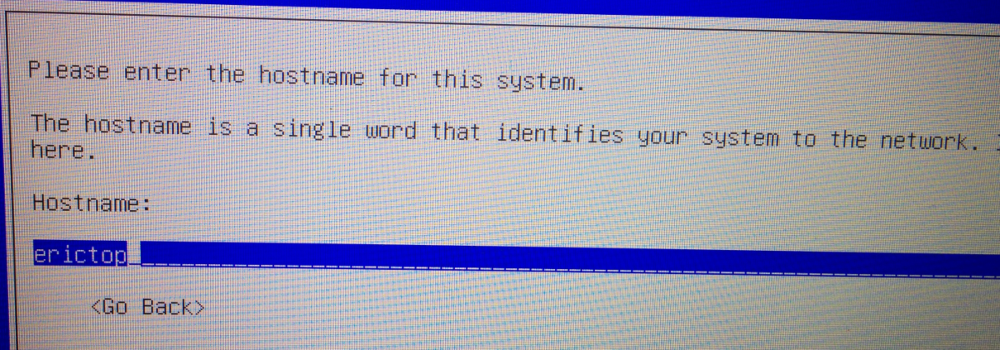

* When it asks for a domain name, leave it blank and hit Enter.


* Enter a password for the `root` user, and verify the password.

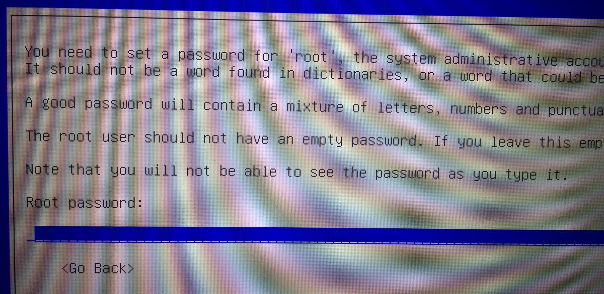

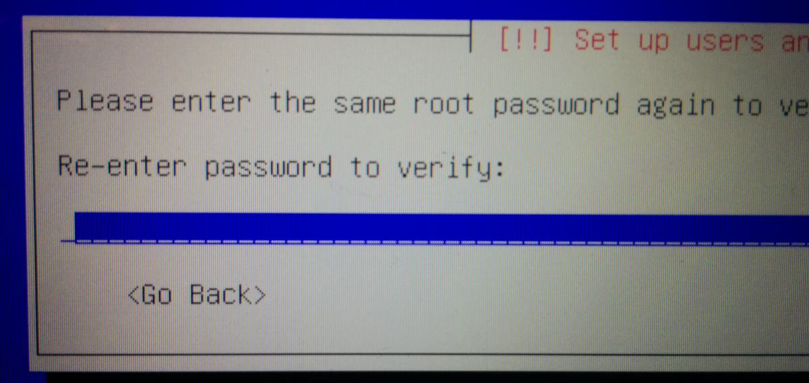

* Now you'll make a user account. Enter your full name (e.g. `Eric Mill`).


* And pick a username (e.g. `eric`). This is the user you'll be running as.

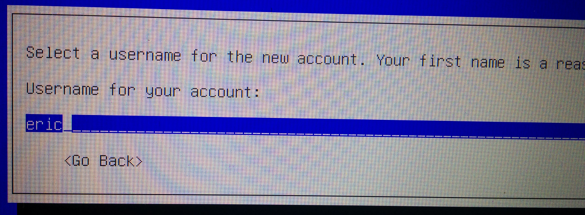

* Enter a password for that user, and verify that password.

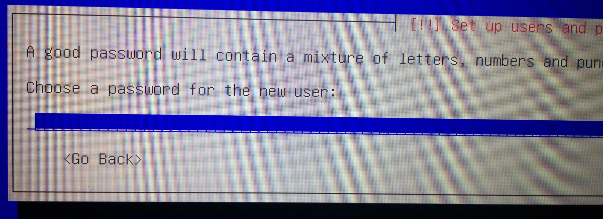

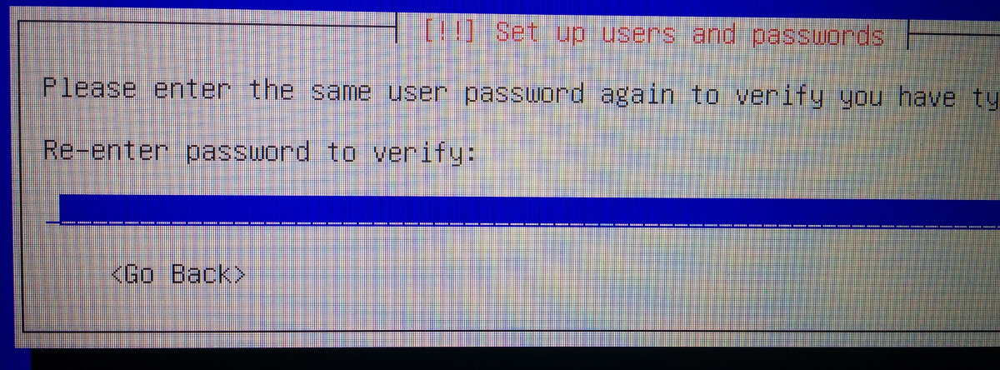

* Pick your time zone.

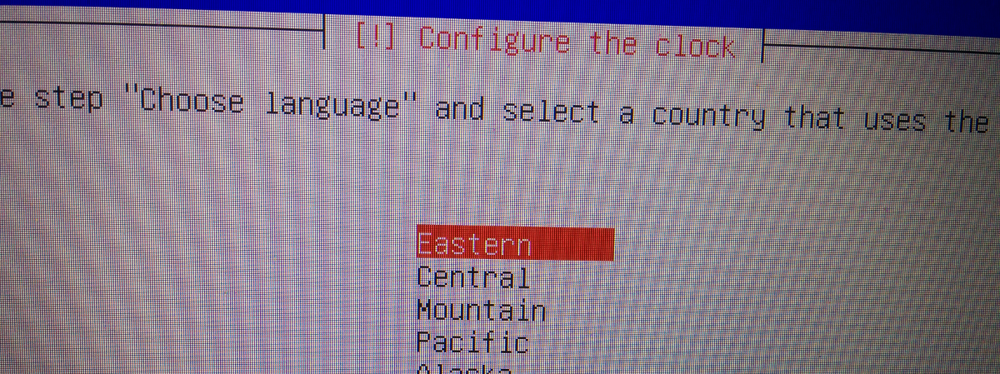

### Setting up your disk

Now you'll be asked about disk stuff. This can be intimidating, but don't worry about it.

I'm going for **full disk encryption**. The Debian installer makes this super easy. The downsides are:

* You'll enter a password when you boot your computer up, or resume from hibernation. (Not from ordinary sleep.)
* Can add some slight latency on some kinds of disk writes. This isn't a common problem, and you shouldn't notice much of anything in practice.
* Will make the _install_ process take a couple hours, as it first erases every block of the disk.

The upside is your **entire disk is goddamn encrypted**, which makes you more safe from attackers the world over. And **it's so easy**: besides the boot password, there's no impact on usability. I strongly recommend it.

* To encrypt, go with the third option ("encrypted LVM"):


* It will ask you to confirm which disk you want to encrypt and write Debian to. Make sure you pick your actual hard drive, not the USB flash drive.


* Just put everything on one partition.

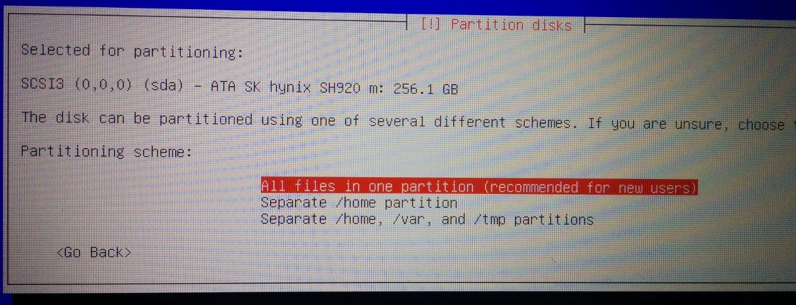

* It'll ask you to really confirm what you're about to do. Say `Yes`:

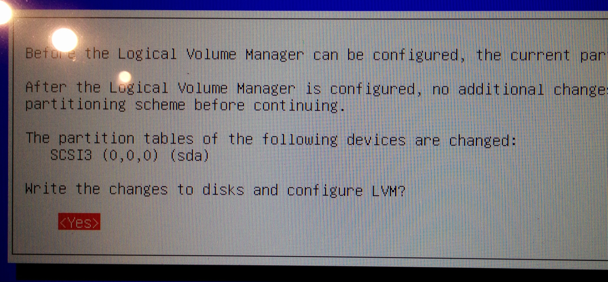

* Then prepare for the disk erasing to take a long time.


* When it finishes, enter in the disk encryption passphrase, and verify it.


* Then you'll get 2 confirmation prompts in sequence, to confirm that you want to write the partitions to disk. Go for it.

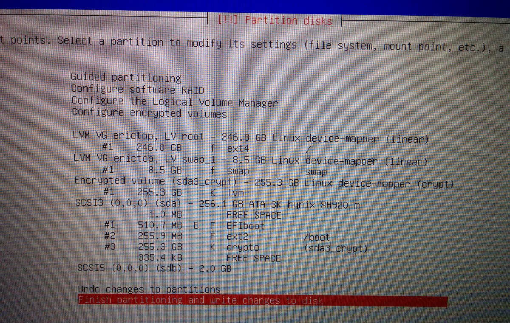


* This will begin installing the base system.


* First, it'll ask you to pick the country it should look for a close Debian archive in.


* Then, it'll offer you some specific mirrors. Pick whatever.


* It'll ask you to pick a proxy. You can leave it blank and hit `Enter`.


* It will ask you whether you'd like to participate in submitting weekly analytics to the Debian team about your packages. As of version 1.6 of `popcon`, which is contained in the `.iso` I downloaded, this information is encrypted, so I elected to participate.


* It will ask about what pieces of the system you'd like to install. I recommend changing from "MATE" to "GNOME" so that the selections are: "Debian desktop", "GNOME", "print server", "standard system utilities".


* When it finishes, you should be done!


Reboot the computer.

### Debian: First Boot

On your first boot, you should end up at the new Debian-themed Grub boot loader. The default is what you want, and you can either hit Enter or it it will proceed automatically after a few seconds.

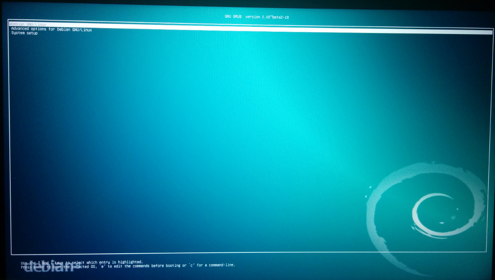

On your first boot, the disk decryption prompt is scary and stark. **We'll make this screen much nicer on future boots** in a moment, but for now just enter your disk decryption passphrase.

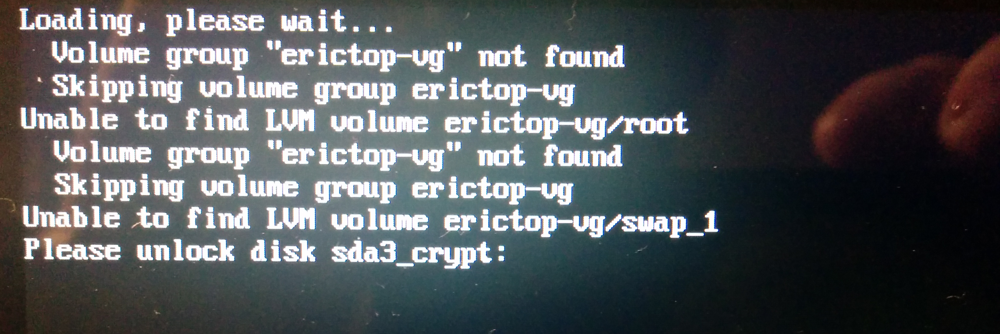

You should end up at a pleasant login screen!

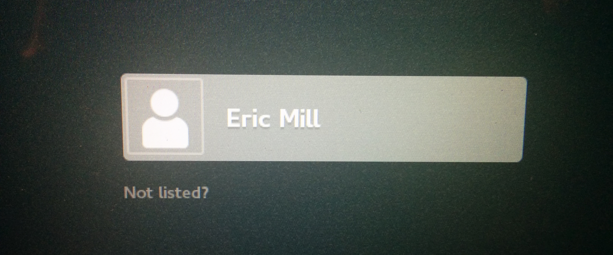

And after logging in with your user password, you should end up at a pleasant desktop!

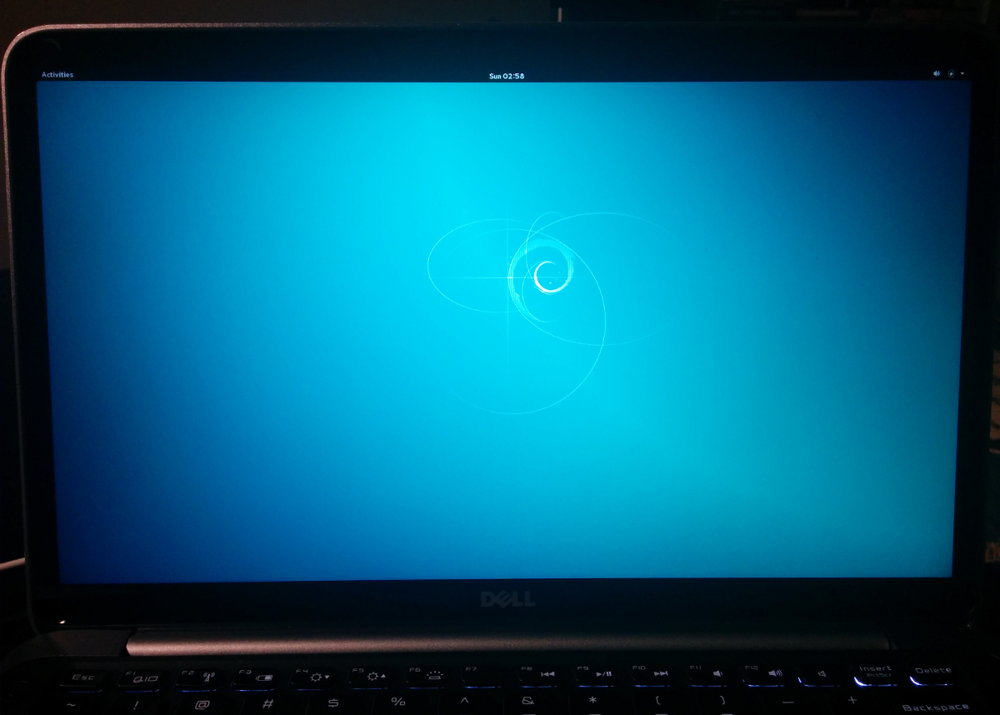

Try [testing out your touch screen](https://www.youtube.com/watch?v=sowvI6FisUc).

Now we'll take care of a few things you'll almost certainly want around for day-to-day Debian use.

#### Giving yourself sudo

First, become root and install sudo:

```
su
apt install sudo
```

Then add yourself to sudo. Replace `eric` with your username:

```bash
adduser eric sudo
```

**Log out and log in** to get this to take effect.

#### Installing nonfree graphics firmware

It's a bummer, but nonfree software is necessary to have working WiFi, a non-buggy graphics card, and to use a graphical boot screen when typing in the decryption password.

I observed at least one hard graphics crash/freeze before installing this firmware. If you observe this, try installing the firmware and seeing if it occurs again.

Edit `/etc/apt/sources.list` to add `contrib non-free` to the end of each entry. Mine ended up looking like this:

```
deb http://ftp.us.debian.org/debian/ stretch main contrib non-free
deb-src http://ftp.us.debian.org/debian/ stretch main contrib non-free

deb http://security.debian.org/debian-security stretch/updates main contrib non-free
deb-src http://security.debian.org/debian-security stretch/updates main contrib non-free
```

Then update `apt` and install the nonfree firmware:

```
sudo apt update
sudo apt install firmware-linux-nonfree
```

#### Working WiFi

Next, let's get your WiFi working. You'll need to have installed non-free firmware (see above).

```bash
sudo apt install firmware-iwlwifi
```

On your next boot, you should see working WiFi:

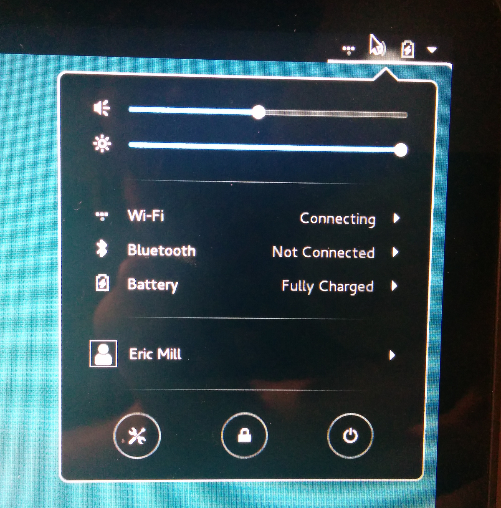

#### Scaling up for the high-res screen

You'll want to scale GNOME, as well as any web browsers, to use a scaling factor of 125%.

**In GNOME**, just run:

```bash
gsettings set org.gnome.desktop.interface text-scaling-factor 1.25
```

(There's a preferences pane for this, but it won't let you set decimal values.)

**In Firefox**, visit about:config, and search for "css". Find `layout.css.devPixelsPerPx` and change the value from `-1.0` (system default) to `2.25`. (Yes, `2.25`.)

#### Graphical boot

Now we'll fix that scary decryption screen we saw on the first boot. You'll need to have installed non-free firmware (see above).

To enter your disk decryption password in a clean, well-lighted place, you need to [install Plymouth](https://miguelmenendez.pro/en/articles/install-plymouth-debian-graphical-boot-animation-while-boot-shutdown.html).

You'll also need to install necessary non-free firmware.

Start with:

```bash
sudo apt install plymouth plymouth-themes
```

Then edit `/etc/initramfs-tools/modules` and add the following lines:

```
# KMS
  intel_agp
  drm
  i915 modeset=1
```

Then edit `/etc/default/grub` and add this line:

```
GRUB_GFXMODE=1920x1080
```

And **edit** the `GRUB_CMDLINE_LINUX_DEFAULT` line to read:

```
GRUB_CMDLINE_LINUX_DEFAULT="quiet splash"
```

Update Grub to pick up the changes:

```bash
sudo update-grub2
```

Set the default theme to `lines`:

```bash
sudo /usr/sbin/plymouth-set-default-theme lines
```

Apply the changes:

```bash
sudo update-initramfs -u
```

On your next boot, you should see a nice graphical interface when it's time to enter your disk password. The nice `lines` background should even animate for a second during the decryption.

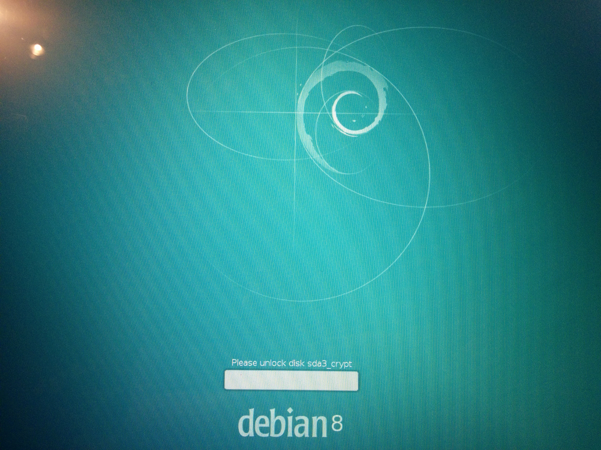


### Debian: Is Awesome

Thanks for reading! Enjoy the feeling of running a beautiful, powerful computer maintained by a global community of dedicated, passionate people that believe in a world of free software.

That said, there's no easy Q&A archive like [Ask Ubuntu](https://askubuntu.com) for common problems. You're best off making friends in the Debian community, and asking around in the **#debian** IRC channel on `irc.oftc.net`. Debian has [some tips for you](https://wiki.debian.org/GettingHelpOnIrc) on it.

Friendship and computers are what Debian is all about!

[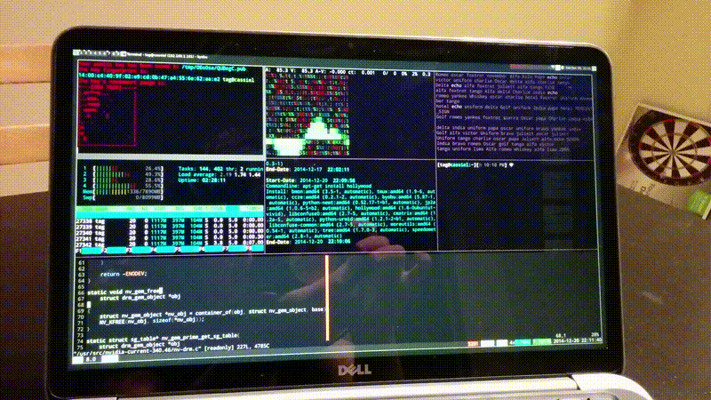](http://blog.dustinkirkland.com/2014/12/hollywood-technodrama.html)

### TODO

Some notes for myself of stuff to do later:

* extensions.gnome.org
* "alternate tab" extension for normal alt+tab behavior
* get ubuntu monospace font
* static workspaces
* workspace grid
  - download zip of fork of workspace grid extension on github
  - open up gnome-tweaks and load in .zip
  - open up gnome-shell-extension-prefs and enable it
  - on next boot/login it should work
* moving from unity to gnome 3
  - from Alt+Click to Super+Click for dragging windows
  - Ctrl+Delete for deleting things in the explorer
* test out u2f instructions
  - if they work, update blog post to say debian also
* update my personal ubuntu repo to point to debian repo
* 

### Jay Say 

I'm loving Stretch as my primary OS on a mac pro and a HP dv7 laptop. The only reason I even have OSX now is music for Logic Pro. Been on debian/ubuntu for a year now deb for the last 6/mo. I really enjoy it and don't plan on going back to osx. I've got native video drivers on UEFI working and all hardware on a Mac Pro 3,1, Macbook Pro 6,2 and the HP lap. I've figured out many little things about the OS I'll try to add some that mayyyy help who knows. I've considered plenty of times contributing to Gnome Shell, it is a lot of CSS and Javascript which is good for me ;) This might have been a better email than a pull request...

* http://askubuntu.com/a/613573 - How I got native nvidia drivers going on my Mac Pro 3,1/UEFI. My favorite stationary machine for Linux, was very surprised how well everything works. 32gb in it, 3,1 was the first 64-bit Mac Pro tower and they over built it. Getting native 3d drivers working made life more fun, still doing Quake 3 FPS as my only gaming experience. I digress.
* Any time you may experience trouble in Gnome Shell, hit Alt+F2 and before you even see any dialog type "r" and hit enter. This will restart Gnome shell only, not your apps and save your session in many "total freeze" like scenarios.
* sudo apt-get install ttf-freefont ttf-bitstream-vera ttf-dejavu ttf-liberation (before the next step for fonts, installs required fonts for the infinality package)
* For nice font rendering easily more like Ubuntu in Debian I like to use Infinality. The instructions that I used were from here (https://www.linuxbabe.com/desktop-linux/improve-font-rendering-on-debian-8-by-install-infinality-and-google-fonts). Replace trusty in those commands with your release (jessie,stretch etc..) I liked Ubuntu's DejaVu fonts so I used their Linux setting with the setstyle command and then I also go into Tweak Tool and change the Cantarell Fonts all to DejaVu Book.
* sudo apt-get install activity-log-manager - Mmanage the "journal" service the OS keeps of your actions by default. Some people called this spyware in Ubuntu but it's in debian as well.
* I disable "edge tiling" that maximizes a window in Gnome Shell when you drag it to the top of the screen (gsettings set org.gnome.shell.overrides edge-tiling false)
* Gnome Shell extensions I have installed - OpenWeather,Freon(sudo apt-get install lm-sensors first),Dash to Dock,Clipboard Indicator,Steal my Focus,Transprent Top Bar.
* Spotify runs nicely for me if you do that for music (https://www.spotify.com/us/download/linux/)
* Redshift like fl.ux on Mac for night-time colors (sudo apt-get install redshift redshift-gtk), to configure (http://jonls.dk/redshift/#configuration-options)
* You may laugh and return to the terminal but sometimes Git GUI's are helpful (sudo apt-get install gitg)
* There are countless other things I've had to tweak, if you have anything else you'd like to customize I may know how. jason@arcanalabs.com

